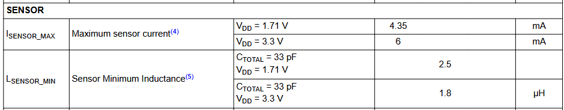

# Encoder Design
### PCB Inductor Requirements
flat pancake coil, using Wheeler's equation

LDC0851 requires a minimum inductance of 1.8uH at 3.3V

Datasheet: https://www.ti.com/lit/ds/symlink/ldc0851.pdf?HQS=dis-dk-null-digikeymode-dsf-pf-null-wwe&ts=1785795026908&ref_url=https%253A%252F%252Fwww.ti.com%252Fgeneral%252Fdocs%252Fsuppproductinfo.tsp%253FdistId%253D10%2526gotoUrl%253Dhttps%253A%252F%252Fwww.ti.com%252Flit%252Fgpn%252Fldc0851

Targeting 1 cm (~394mil) outer diameter coil (chosen arbritrarily, as a round but small value)
- outer radius = ~197mils

PCB manufacturing tolerances dictate 6 mil trace width & spacing
- max number of coils = radius of coil/thickness of trace & space = (394/2)/(2\*6) = 16.4, round to 16
- choose 14 coils (2 less than max to account for via in center)

difference between outer and inner radii? (needed for Wheeler equation)
- difference = (num coils)(thickness of trace & space) = (14)(6)(2) = 168 mils

inner radius = outer radius - difference = 197 - 168 = 29 mils

average radius of coil (needed for Wheeler equation)
- average radius = inner radius + 1/2 \* outer radius = 29 + (197/2) = 127.5 mils

### PCB Inductor Design
Wheeler equation for inductance of a flat "pancake" coil.
$$
L=\frac{a^2n^2}{8a+11c} \quad (\mathrm{\mu H})
$$
- $L$ = inductance ($\mathrm{\mu H}$) = ?
- $a$ = average radius of coil (inches) = 0.1275"
- $c$ = difference between outer and inner radii (inches) = 0.168"
- $n$ = number of coils = 14
$$
L=\frac{0.1275^2 14^2}{8(0.1275)+11(0.168)} \quad (\mathrm{\mu H}) = 1.11\mathrm{\mu H}
$$
FAIL